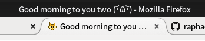

# Twab

This is a prototype for a minimalist microblogging engine based on browser tabs.  
Don’t forget to check [why this is cool](http://lab.raphaelbastide.com/twab/info.html)!

## Install

It is written with a couple of lines of PHP, just drop it on your server and edit config-example.php. Once you have changed the `userName`, `userpass` and `userurl`, rename config-example.php to config.php.

To write a new message, open `/new.php` in a browser.

## Twabberz

- http://lab.raphaelbastide.com/twab/
- http://flux.quaternum.net/twab/
- http://hugohil.ninja/twab using [node-twab](https://github.com/hugohil/node-twab) by @hugohil
- http://www.gaduman.com/twab/
- http://pierrebertet.net/twab/
- http://soymalau.com/twab/

Not on the list? Let me know where you twab URL by [email](mailto:bonjour@raphaelbastide.com)!

## License

Twab is under [GNU GPL](https://www.gnu.org/licenses/gpl.html).
